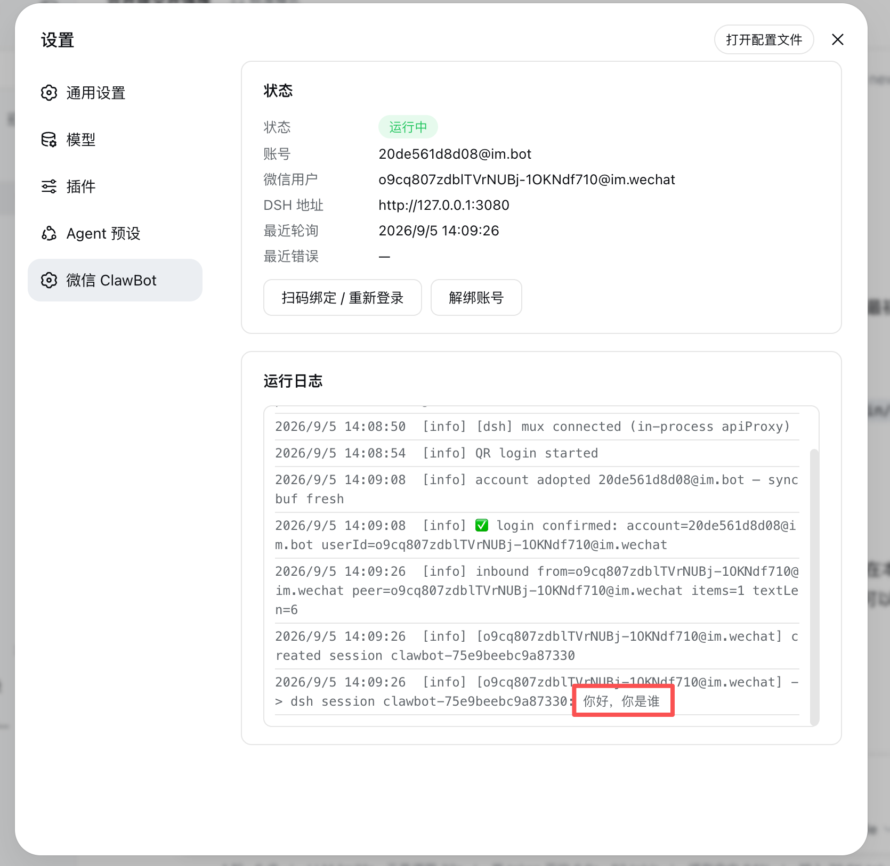
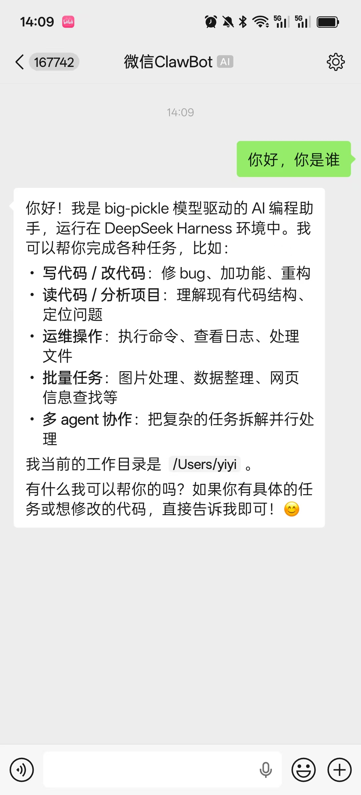

# dsh-plugin-clawbot

DSH（DeepSeek Harness）的**微信 ClawBot 通道插件** —— 与微信 ClawBot
（`@tencent-weixin/openclaw-weixin` 协议）双向通信，并支持**扫码登录 / 重新绑定账号**。
管理面板已集成进 DSH Web **设置界面**的左侧菜单（「微信 ClawBot」）。

- 收到微信消息 → 写入对应 DSH 会话 → 等待智能体回复 → 回发微信
- 微信凭据自动从 ClawBot 账号库（`~/.openclaw/openclaw-weixin`）发现，
  与 OpenClaw 通道共用账号，互不覆盖游标
- 管理面板位于 DSH 设置 → 「微信 ClawBot」：查看状态、扫码绑定、重新登录、解绑账号、运行日志
- token 过期（errcode=-14）时通道自动暂停，在面板重新扫码即可
- 面板样式跟随 DSH 主题（浅色 / 深色自适应）

## 安装（DSH 插件方式）

插件已发布到 **npm**，直接安装包名即可：

```bash
dsh plugin --profile web add dsh-plugin-clawbot
```

安装后即可用（插件自带的 `cordis.patch.yml` 作为 bundle 层会自动激活 clawbot 行）。

然后重启：

```bash
dsh web
```

重启后：

- 打开 DSH Web 设置界面 → 左侧菜单出现 **「微信 ClawBot」**
- 首次使用：点开面板 → 「扫码绑定 / 重新登录」→ 手机微信扫码 → 自动生效
- 已绑定账号时重启自动复用，无需重新扫码
- 微信 token 过期后通道暂停，在面板重新扫码即可

## 运行截图

管理面板位于 DSH 设置 → 「微信 ClawBot」，浅色 / 深色主题自适应：





## 消息命令

- `/new`、`/reset` — 为当前联系人开启全新会话
- `/help` — 帮助
- 其他文本 → 发送给 DSH 智能体

## 结构

```
src/               TypeScript 源码（Host 半侧）
  index.ts         插件入口
  manager.ts       通道生命周期 / 轮询 / 消息处理 / 登录状态机
  weixin.ts        ClawBot API 客户端（getupdates / sendmessage / 扫码）
  dsh.ts           DSH API 客户端
  config.ts        配置解析 + 账号库
  settings.ts      设置命名空间（Host 半侧）
  state.ts         状态持久化
  ui.ts / qr.ts    保留的旧 HTML 渲染（非入口）
src/client/        React 客户端半侧（浏览器）
  index.tsx        注册「微信 ClawBot」设置菜单项
  ClawbotSection.tsx 面板组件（状态 / 扫码 / 解绑 / 日志）
  api.ts           面板调用 /clawbot/api/* 的客户端
  locales.ts       中英文案
lib/               构建产物（由 src/ 编译，勿手改）
client/            客户端 bundle 构建产物
scripts/           构建脚本
test/              测试
```

## 构建

运行时所需的 `lib/` 与 `client/` 都是构建产物，已加入 `.gitignore`：

```bash
npm install        # 安装 devDependencies
npm run build      # esbuild 编译 Host + tsdown 打包客户端
```

> 从 GitHub 克隆下来的源码不含构建产物（`lib/`、`client/` 已忽略），
> 构建后才能作为插件加载。

## 后端 HTTP 接口（面板数据源，/clawbot/api/*）

仅供面板及同机调用，仅接受回环 Host（与 DSH /api 信任围栏一致，防 DNS rebinding）：

- `GET  /clawbot/api/status` — 状态 JSON（含日志尾部）
- `POST /clawbot/api/login/start` `{force?}` — 获取登录二维码
- `POST /clawbot/api/login/poll` `{verifyCode?}` — 长轮询扫码状态
  （`wait/scaned/confirmed/expired/need_verifycode/...`；confirmed 即绑定并热切换）
- `POST /clawbot/api/login/cancel` — 取消登录
- `POST /clawbot/api/unbind` — 解绑当前账号
- `POST /clawbot/api/resume` — 手动恢复通道

## 注意事项

- **不要与 OpenClaw 微信通道同时运行**（共享 getupdates 游标）。
- 重新扫码绑定后，旧账号文件会被清理（同一微信用户只保留最新账号），
  会话映射与上下文 token 保留，聊天连续性不受影响。
- 媒体消息（图片 / 语音）目前仅返回"暂不支持"提示；语音若带转写文本则直接使用。

## License

MIT